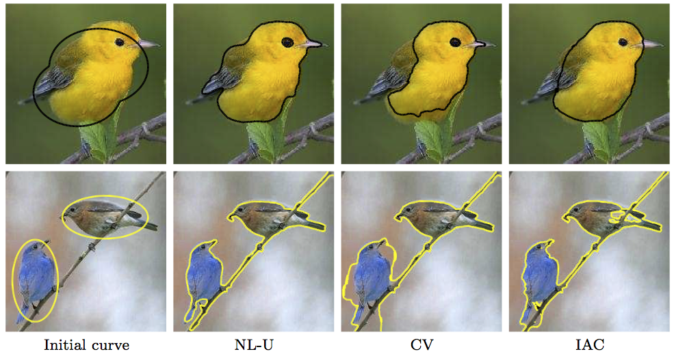

This Matlab package contains the source code to reproduce the figure of the article:

M. Jung, G. Peyré, L. D. Cohen. [Nonlocal Active Contours](https://hal.archives-ouvertes.fr/hal-00650735). SIAM Journal on Imaging Sciences, 5(3), pp. 1022–1054, 2012.

=========
main_nonlocal_seg.m

Non-local Active Contours, Two Non-local models: "un-normalized" (NL-U) / " normalized" (NL-N), using:
* (1) L2-distance: pixel values (intensity, color, Gabor coefficient)
* (2) Wasserstein distance: texture
* (3) Motion distance using motion profiles

=========
main_other_methods.m

Implements:
* GAC,
* CV,
* IAC (pixel based)

Copyright (c) 2011 Miyoun Jung
